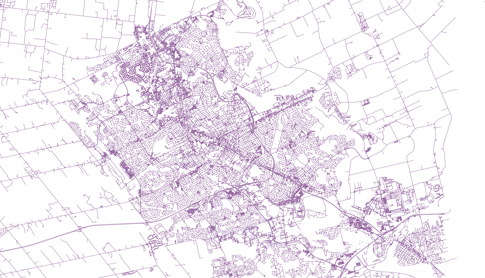

# PostgreSQL pgRouting for Kitchener/Waterloo

> 🚀 **One-Click Routing Service for KW** - Transform coordinates into optimized routes instantly!

> ⚡ **Plug & Play VM Setup** - One script installs everything: PostgreSQL, PostGIS, pgRouting, and imports Kitchener road data. Just configure FastAPI and you're ready to route!

A powerful routing API built with FastAPI, PostgreSQL, PostGIS, and pgRouting that provides multi-stop route optimization for the Kitchener-Waterloo region. The API uses the A\* algorithm for efficient pathfinding and returns routes in GeoJSON format for easy visualization.

## 🚀 Features

- **Multi-stop Route Optimization**: Generate optimized routes with up to 100 stops using pgRouting
- **A\* Algorithm**: Fast and efficient pathfinding using PostgreSQL's A\* implementation
- **Coordinate-based Routing**: Direct routing between lat/lng coordinates
- **GeoJSON Support**: All routes returned in GeoJSON format for easy mapping and visualization
- **Time-based Cost Calculation**: Routes consider speed limits and travel time
- **QGIS Integration**: Visualize road networks and vertices using QGIS
- **GeoJSON.io Support**: Check and validate routes using geojson.io
- **RESTful API**: Clean, well-documented endpoints with automatic OpenAPI docs

## 🏗️ Architecture

- **Backend**: FastAPI (Python)
- **Database**: PostgreSQL with PostGIS and pgRouting extensions
- **Frontend**: Next.js 15 with React 19 and Tailwind CSS
- **Routing Engine**: pgRouting with A\* algorithm
- **Visualization**: QGIS for map data visualization

## 📋 Prerequisites

- Python 3.8+
- PostgreSQL 17+
- Node.js 18+
- QGIS (for map visualization)
- 8GB RAM (for Kitchener region OSM data)

## 🛠️ Installation

### 1. Clone the Repository

```bash
git clone https://github.com/neelvaidya133/postgresRouting.git
cd postgresRouting
```

### 2. Database Setup

Run the automated setup script to configure PostgreSQL with PostGIS and pgRouting:

```bash
chmod +x setup.sh
./setup.sh
```

This script will:

- Install PostgreSQL, PostGIS, and pgRouting
- Download and process Ontario OSM data
- Extract Kitchener region data
- Import road network into the database
- Create performance indexes
- Add time-based cost calculations

### 3. API Setup


```bash
# Install Python dependencies
pip install -r requirements.txt
```

### 5. Start the API Server

```bash
# Start the FastAPI server
python main.py
# or
uvicorn main:app --host 0.0.0.0 --port 8000
```
The setup script automatically installs Python packages and starts the FastAPI server. No additional steps needed!

## 📚 API Endpoints

### Routing

#### Coordinate-based Routing

```http
POST /route
Content-Type: application/json

{
  "start_coords": "43.43656,-80.45172",
  "end_coords": "43.45067,-80.49208"
}
```

#### Multi-stop Route from Coordinates

```http
POST /route-from-batch
Content-Type: application/json

{
  "geocode_results": [
    {
      "stop_number": 1,
      "address": "Stop 1: 85 Duke St, Kitchener, ON",
      "lat": 43.451715,
      "lng": -80.4913,
      "formatted_address": "85 Duke Street West, Kitchener, Ontario N2H 0B7, Canada",
      "confidence": 0,
      "status": "success"
    },
    {
      "stop_number": 2,
      "address": "Stop 2: 155 King St, Kitchener, ON",
      "lat": 43.450672,
      "lng": -80.492076,
      "formatted_address": "155 King Street West, Kitchener, Ontario N2G 1A7, Canada",
      "confidence": 0,
      "status": "success"
    }
  ]
}
```

## 🔧 Configuration

### Database Configuration

The setup script uses these default settings (modify in `setup.sh`):

```bash
DB_NAME="kitchener_routing"
DB_USER="postgres"
DB_PASSWORD="takeme@kw"
BOUNDING_BOX="-80.6639970464,43.3480624398,-80.3339821224,43.5571680888"
```

### API Configuration

Update database connection in `main.py`:

```python
def get_connection():
    return psycopg2.connect(
        dbname="kitchener_routing",
        user="postgres",
        password="your_password",
        host="localhost",
        port="5432"
    )
```

## 🗺️ Supported Regions

Currently configured for the Kitchener-Waterloo region in Ontario, Canada. To support other regions:

1. Update the `BOUNDING_BOX` in `setup.sh`
2. Download the appropriate OSM data file
3. Re-run the setup script

## 📊 Performance

- **Routing**: Up to 100 stops per route using A\* algorithm
- **Database**: Optimized with spatial indexes for fast queries
- **Memory**: Requires 8GB RAM for Kitchener region processing
- **Algorithm**: A\* provides optimal pathfinding with good performance

## 🗺️ Visualization

### QGIS Integration

Use QGIS to visualize the road network and routing data:

1. **Connect to PostgreSQL Database**:

   - Open QGIS
   - Go to Layer → Add Layer → Add PostGIS Layers
   - Create new connection with your database credentials
   - Add `ways` table to see the road network
   - Add `ways_vertices_pgr` table to see routing vertices

2. **Visualize Routes**:
   - Copy the GeoJSON response from API calls
   - Use QGIS's "Add Vector Layer" → "GeoJSON" to import route data
   - Style the layers for better visualization

### Examples 



### GeoJSON.io Integration

1. **Validate Routes**:

   - Copy the `route_geojson` from API responses
   - Paste into [geojson.io](https://geojson.io)
   - View the route on an interactive map
   - Verify route accuracy and path

2. **Share Routes**:
   - Use geojson.io to share route visualizations
   - Export as different formats if needed

## 🧪 Testing

Test the API endpoints using the interactive docs at:

- http://localhost:8000/docs (Swagger UI)
- http://localhost:8000/redoc (ReDoc)


### Production Considerations

- Use environment variables for sensitive configuration
- Set up proper database connection pooling
- Configure reverse proxy (nginx)
- Enable SSL/TLS
- Monitor API usage and performance

## 📝 API Response Examples

### Successful Route Response

```json
{
  "success": true,
  "route_geojson": {
    "type": "MultiLineString",
    "coordinates": [
      [
        [-80.4913, 43.451715],
        [-80.492076, 43.450672]
      ]
    ]
  },
  "total_stops": 2,
  "stops": [
    {
      "stop_number": 1,
      "address": "Stop 1: 85 Duke St, Kitchener, ON",
      "lat": 43.451715,
      "lng": -80.4913,
      "formatted_address": "85 Duke Street West, Kitchener, Ontario N2H 0B7, Canada"
    }
  ]
}
```

### Using the GeoJSON Response

1. **Copy the `route_geojson` field** from the API response
2. **Paste into [geojson.io](https://geojson.io)** to visualize the route
3. **Import into QGIS** for detailed analysis and styling

## 🤝 Contributing

1. Fork the repository
2. Create a feature branch (`git checkout -b feature/amazing-feature`)
3. Commit your changes (`git commit -m 'Add some amazing feature'`)
4. Push to the branch (`git push origin feature/amazing-feature`)
5. Open a Pull Request

## 📄 License

This project is licensed under the MIT License - see the [LICENSE](LICENSE) file for details.

## 🙏 Acknowledgments

- [PostGIS](https://postgis.net/) for spatial database capabilities
- [pgRouting](https://pgrouting.org/) for routing algorithms and A\* implementation
- [FastAPI](https://fastapi.tiangolo.com/) for the web framework
- [OpenStreetMap](https://www.openstreetmap.org/) for map data
- [QGIS](https://qgis.org/) for map visualization capabilities


**Note**: This API is specifically optimized for the Kitchener-Waterloo region. For other regions, you'll need to download and process the appropriate OpenStreetMap data and update the configuration accordingly.


---

Made with ❤️ by **Neel Vaidya**

